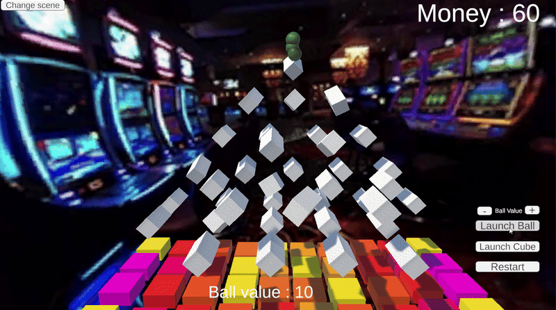

# Physics Engine

Real time physics engine made in 2 months with a team of 2 people. Capable of detecting collisions and response accordingly.

## Features
- Real time Broad phase collision detection with dynamic AABB tree.
- Real time Narrow phase collision detection with GJK algorithm.
- Real time collision response with EPA algorithm.
 
## Demo 

